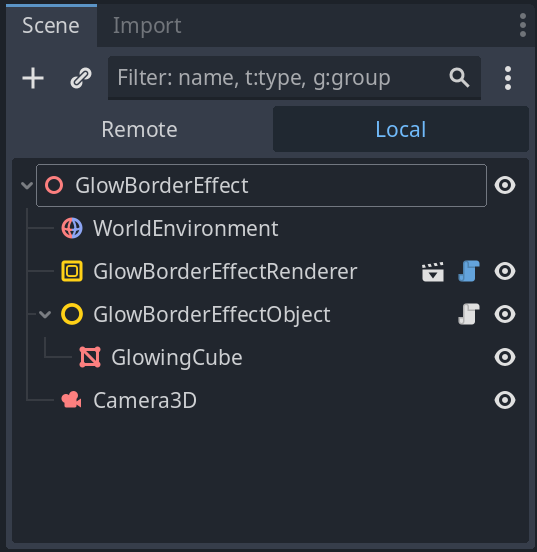

# Glow Boarder Effect


The **Glow Boarder Effect Renderer** contains shader setup with a glowing boarder effect for selected objects.
The user can turn the **glow border effect** on and off and select **glow color** for individual objects.

# How does it work?


The **GlowBorderEffectRender** scene is included in the scene tree and objects that should recevie the glow border effect
must include the GDScript **glow_border_effect_object.gd** on Spatial node that is a parent to any **VisualInstances** the object
may consists of. In the demo project the GlowingObject is a Spatial node with a MeshInstance as the child.

## Updating camera

In the **GlowBorderEffectDemo** a GDScript is used on the scene **Camera** to ensure that the internal cameras
of the **GlowBorderEffectRender** is updated when the camera position is update.

```GDScript
# Called when the node enters the scene tree for the first time.
func _ready():
	# Update the internal cameras in the glow border effect renderer
	_glow_border_effect_renderer.set_camera_parameters(self)
	
	# Turn on notification for camera transform changes
	set_notify_transform(true)


func _notification(what):
	# Update the camera transform each time the camera transform change
	if what == NOTIFICATION_TRANSFORM_CHANGED:
		_glow_border_effect_renderer.camera_transform_changed(self)
```

## Resizeing
If the parent viewport change size the internal viewports of the GlowBorderEffectRenderer need
to be updated as well. In the example below the resize function

```GDScript
# Called when the node enters the scene tree for the first time.
func _ready():
	get_viewport().connect("size_changed", self, "resized")


# Callback for handling change in window size
func resized():
	$GlowBorderEffectRenderer.resize()
```

# Behind the scene


Inside the **GlowBorderEffectRender** a number of ViewportContainers and Viewports are used with shaders that
first in the prepass render a shadow instance of each of the objects with glow border effect enabled. The 
prepass is so filtered with a blure filter to produce the glowing effect. Finaly the scene is rendered and a
shader that do:
```
scene_color + (blure - prepass)
```

The different steps are illustrated in the screendump below from the **glow_border_efffect_explained** scene.

## Screenshots


